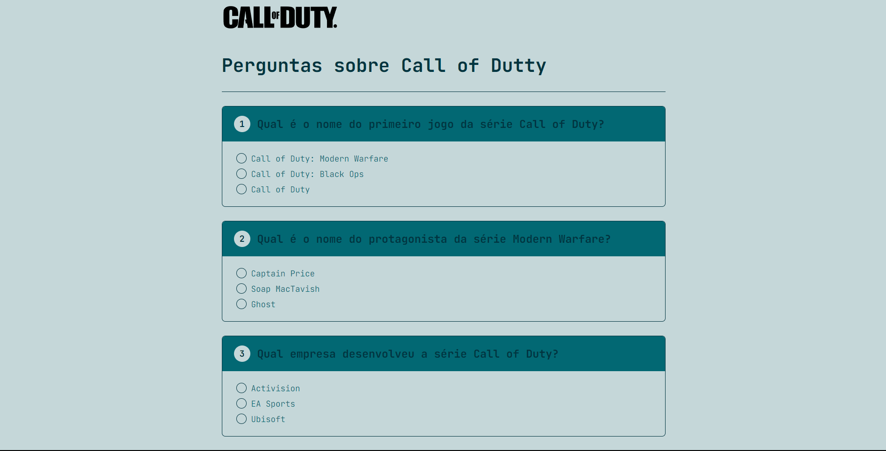

 
<h1 align="center">Quiz</h1>

    Pequeno jogo de perguntas, onde podemos acompnhar o numero de acertos no final da pagina. 
     

    

## 🛸 Tecnologias

Esse projeto foi desenvolvido com as seguintes tecnologias:

- HTML e CSS  
- JavaScript 
- Git e Github  

## 🖥️ Projeto 

- [Da uma olhada ai](https://quiz-khaki-kappa.vercel.app//)

Feito com ♥ by Victor Lima
